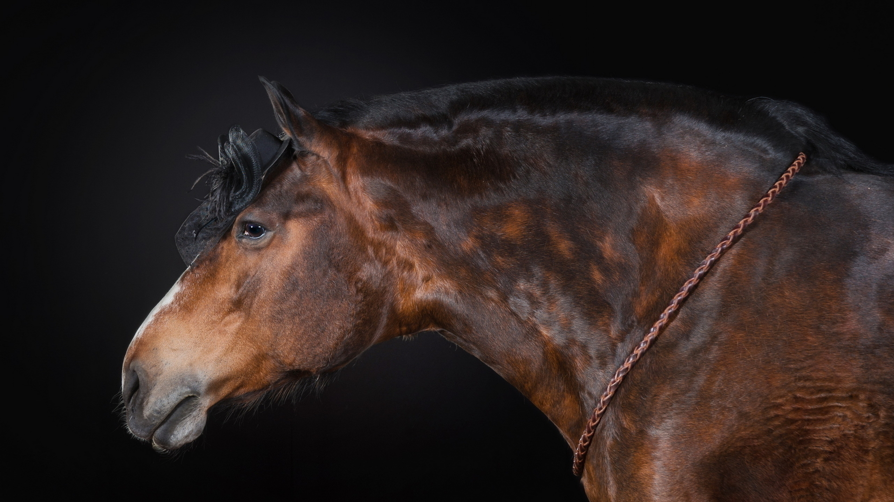
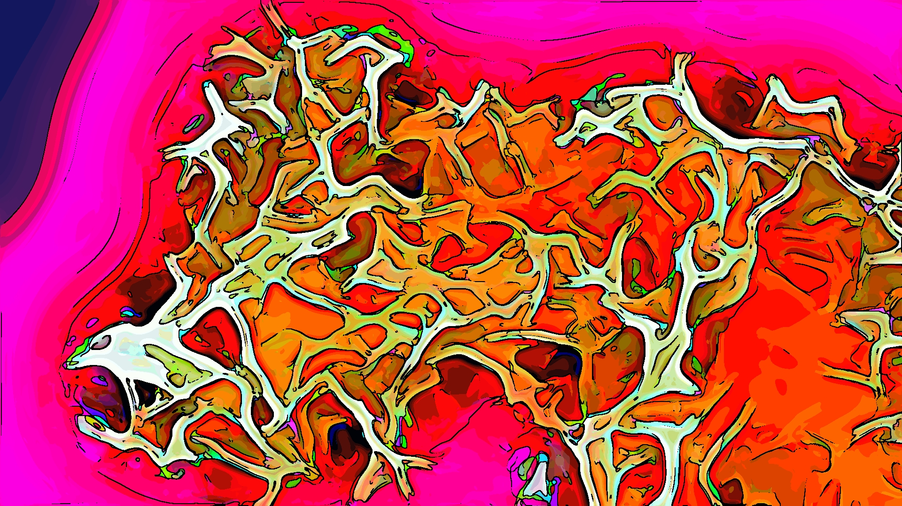
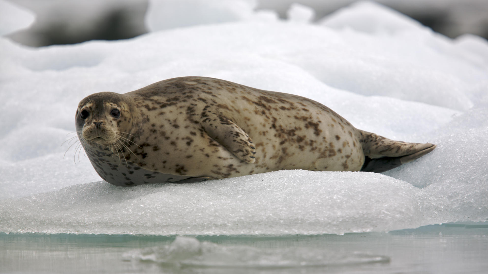
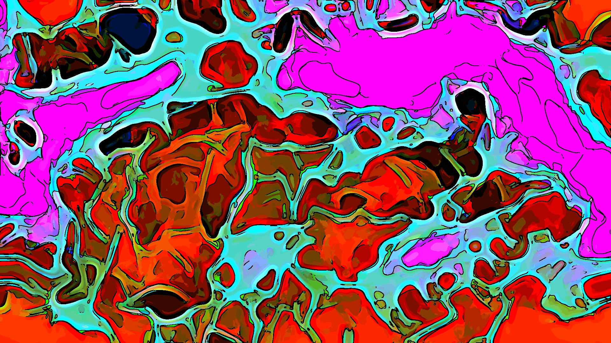
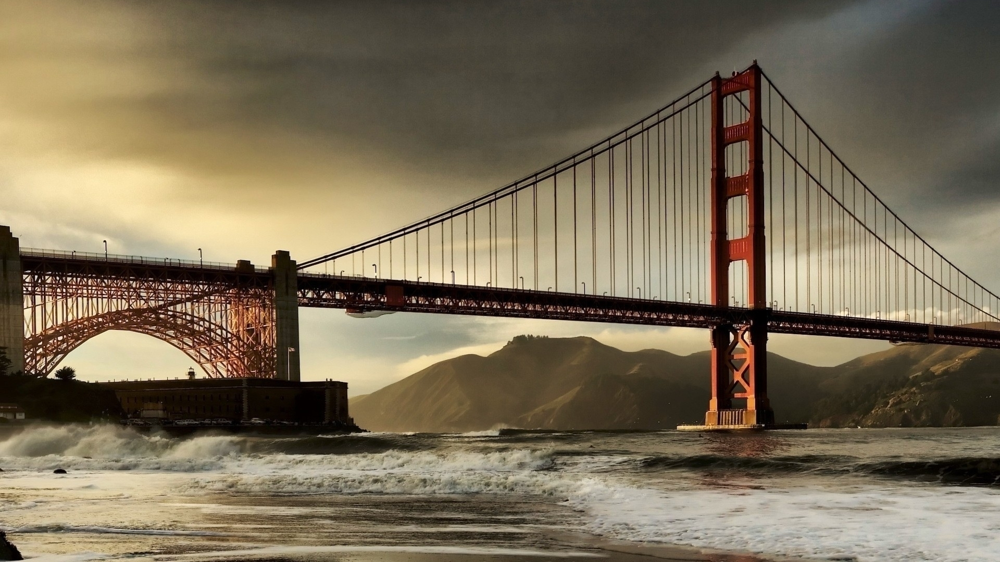
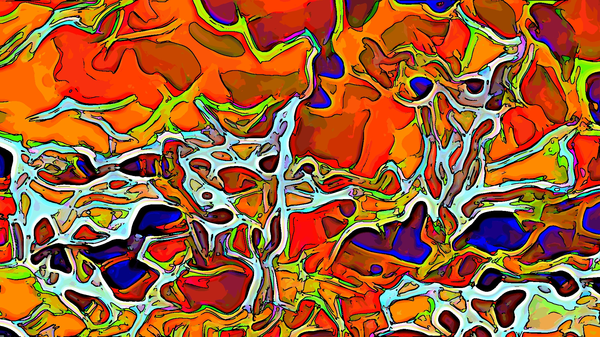

## Mason Filter (fun gmic script)
## This script makes ordinary pictues into works of art

----

*Requires GMIC, ffmpeg, imagemagick*

Image filter:
usage: ./masonfilter.sh <source_dir> <dest_dir> [<resize_dimensions>] [<skip distort="0">]

Video filter:
usage: ./masonvideofilter.sh <source_video> <output_filename> [<frame_rate>] [<resize_dimensions>]

#### Using on image batches:
- 1st (optional) argument is for source dir for images (jpg,jpeg,png,gif)
- 2nd (optional) argument is for dest dir
- 3rd (optional) argument is to resize image to widthxheight dimension
- 4th (optional) argument is to skip image distortion

###### example: 
`./masonfilter.sh` will run against all images in cwd, output to ./modified
`./masonfilter.sh ./sourcedir` will run against all images in ./sourcedir and output to ./modified 
`./masonfilter.sh ./sourcedir /home/user/destdir 1920x1080` will run against all images in ./sourcedir and output to /home/user/destdir, nicely-cropping images to 1920x1080 before calculation.
`./masonfilter.sh ./sourcedir /home/user/destdir "1920x1080" "skip"` will run exactly as above, but will skip distortion steps.

#### Using on video:
- 1st argument is for source video (tested with .mp4)
- 2nd argument is for the filename (sans-extension) that you would like to put this out to
- 3rd (optional) argument is for framerate (defauts to 30)
- 4th (optional) argument is for resize video dimsensions, in widthxheight
  
It's kind of fun to take a large set of ordinary images, and run this against them all, you never know what might come out!

###### example: 
`./masonvideofilter.sh ./sourcevid.mp4 output 60 1920x1080` will split ecach vido second into 60 frames, will resize and calculate against those frames in tmp dir in cwd, will form these back  into video of same framerate.

`./masonvideofilter.sh samplevideo.mp4 output` will work as above, but will default to 30fps, won't resize images before calculation (slower), to output.mp4

#todo- split audio channel and add back in

----
Video example

>[Boring Rollercoaster](https://github.com/masonville17/masonfilter/raw/main/samplevideo.mp4)
>
>[Enhanced Rollercoaster](https://github.com/masonville17/masonfilter/raw/main/output.mp4)

Photo example

>ordinary horse
>
>horse- mason-filter-applied
>

>ordinary seal
>
>seal- mason filter-applied
>

>depressing bridge
>
>stylistic bridge
>